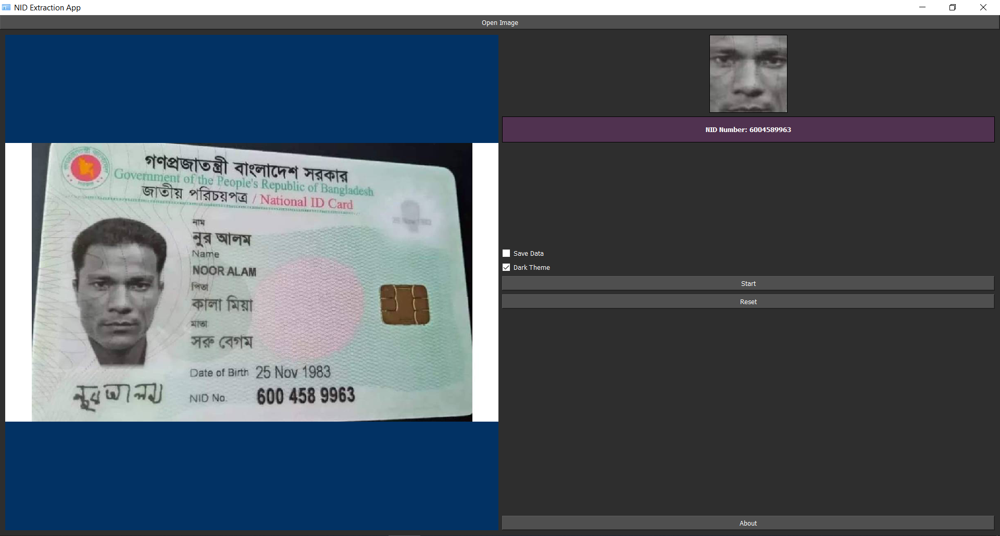

# NID Recognition App

A Python application for recognizing National Identification (NID) numbers from images using OpenCV and pytesseract. This app features face detection, NID number extraction, a dark theme option, and a progress bar to enhance the user experience during processing.

## Features

- **Face Detection**: Detects faces in the selected image using OpenCV.
- **NID OCR**: Extracts NID numbers from the lower part of detected faces using pytesseract.
- **Progress Bar**: Displays progress during face detection and OCR to indicate that processing is ongoing.
- **Dark Theme**: Switch between dark and default themes for better visibility.
- **Save Detected Face**: Option to save detected faces with the NID number as the filename to a user-specified path.
- **Reset Functionality**: Allows users to reset the application to start a new operation.

### Clone the Repository
1. Clone the repository:
   ```bash
   git clone https://github.com/SihabSahariar/NID-Extraction-App.git

### Install Dependencies
2.  Install dependencies:
	```bash
	pip install -r requirements.txt
	
### Run the Application
3.  Run the application:
	```bash
	python main.py


## Screenshots



## Contributing

Contributions are welcome! For major changes, please open an issue first to discuss what you would like to change.

## License

MIT License

## About

NID Recognition App is developed and maintained by Sihab Sahariar. For inquiries, contact us at sihabsahariarcse@gmail.com.
